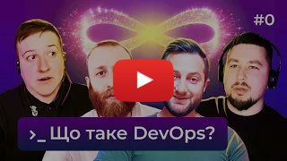

Hi there! 👋

My name is Dmytro, I am in my late-twenties, living in Kyiv, Ukraine. I completed Bachelor's degree in Software 
Engineering. I am a [T-shaped](https://en.wikipedia.org/wiki/T-shaped_skills) `Software Engineer` and `Tech Lead` 
experienced in development and operations in startups and product companies.

I am good at influencing engineering-wide best practices within teams and across others for the full software 
development life cycle, including documentation, design, coding standards, code reviews, building, testing, deployment, 
and other operations as well as leading teams of 3-5 software engineers, coaching and mentoring less experienced 
developers and peers.

I have the following outside-of-work achievements:

* On open source enthusiast being top `5.5K` worldwide by 
  [GitHub accounts ranking](http://159.100.250.9/users/search?login=dmytrostriletskyi). 
* A recurring speaker on the largest Ukrainian IT community's 
  [podcast about DevOps](https://www.youtube.com/playlist?list=PLwj_3ikgO3CLZM1Jm_n5gw2CcoKMaKgD5) 
  with `65K+` subscribers on `YouTube`. 
* An author of `15+` articles about software engineering on `3` different languages that have `325K+` views in total on 
  [Medium](https://dmytrostriletskyi.medium.com), [DOU](https://dou.ua/users/dmytrostriletskyi/articles), and 
  [Habr](https://habr.com/ru/users/dmytrostriletskyi/posts) (not under maintenance).

**The latest articles:**

* [11 must-haves in your vacancy for software engineers](https://dmytrostriletskyi.medium.com/11-must-haves-in-your-vacancy-for-software-engineers-b9396ef24f49) (English)
* [Як оформити резюме, щоб конкурувати з найкращими кандидатами](https://dou.ua/lenta/columns/perfect-resume-for-developer) (Ukrainian)

**The latest video or speech:**

*(DevOps Podcast Episode #0)*

